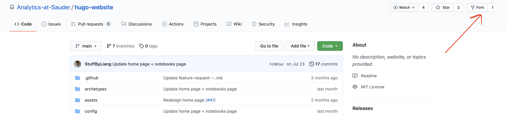
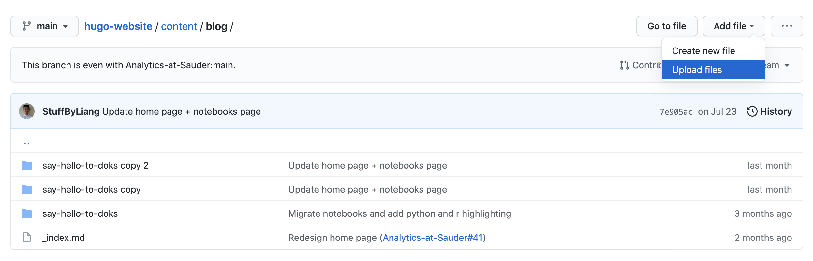
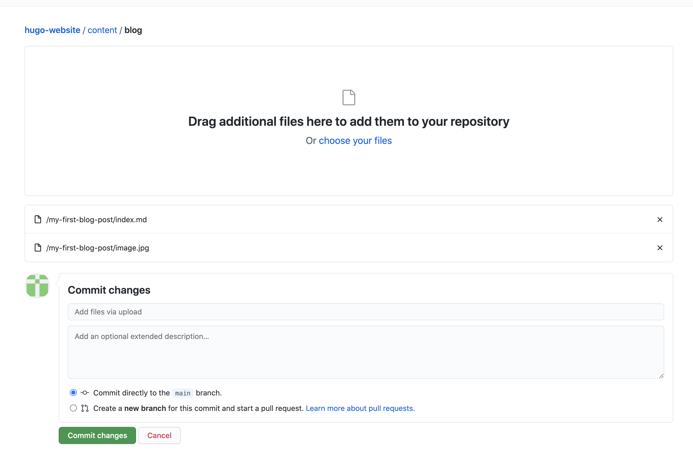
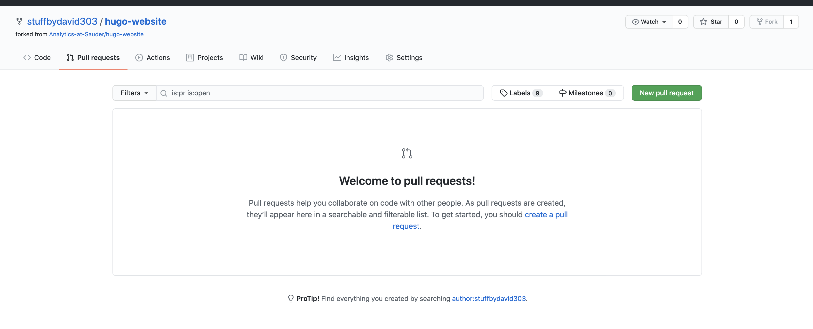
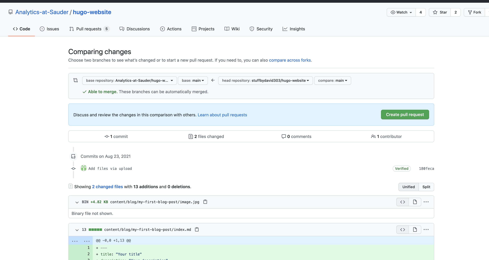

There are two ways to create a blog post.

1. By cloning the project and using the create command
2. By uploading your files to github directly

It is easier create a blog post using the first method.

## Cloning the project and using the create command

Make sure you have the project on your local computer and have the dependencies installed. You can [follow the guide here]().

### Step 1 - run the create command

Run this command to create a new folder in the directory `/content/blog/<your-blog-title>`. Make sure to include a blog title in kebab-case.

```bash
npm run create:blog your-blog-title
```

After running this command, you should see a folder created along with an index.md file inside of it.

### Step 2 - Write your blog post

Open the newly created index.md and begin writing your blog post in markdown. If you need to add any photos, place them in the same directory.

### Step 3 - Check the preview (optional)

Run the site using `npm start` and navigate to `localhost:1313/blog/your-blog-title`. If it all looks good, it's time to upload! otherwise make content edits as necessary.

### Step 4 - Upload the changes

Create a new branch on github and push to it. Open a pull request so that other people can approve it before it's published on the site.

## By uploading your files to github directly

### Step 1 - Create a folder on your local computer

Create a folder titled `<your-blog-title>`. Make sure the title is in `lower-kebab-case`, meaning that all spaces are replaced with a dash, and all characters are in lowercase.

### Step 2 - Create a file

Create a file titled `index.md` within your newly created folder. Make sure to fill in the following:

- `title` - The title of your blog post
- `description` - A brief description for your blog post
- `lead` - A quick one sentence lead for your blog post
- `date` - The current date
- `lastmod` - The current date
- `images` - The file name of the featured image for your blog post
- `contributors` - Your name!

Then, you can start writing your blog post in [markdown](https://www.markdownguide.org/)!

```markdown
---
title: "Your title"
description: "Your description"
lead: "A quick lead"
date: 2020-11-04T00:00:00
lastmod: 2020-11-04T00:00:00
draft: false
weight: 50
images: ["your-image.png"]
contributors: ["Your Name"]
---

<Start writing your blog post here>
```

### Step 3 - Upload an Image

Add an image to your newly created folder with the same filename as the one you filled out in `images` in the previous step.

### Step 4 - Fork the repository

Create a fork of the repository [https://github.com/Analytics-at-Sauder/hugo-website/](https://github.com/Analytics-at-Sauder/hugo-website/).



### Step 5 - Upload files to /content/blog

Next, navigate to the folder `/content/blog/`. this should be located at the following link:

`https://github.com/<your-github-username>/hugo-website/tree/main/content/blog`



### Step 6 - Commit the changes

After uploading the images by drag/drop, make sure to commit your changes by clicking the big green `Commit Changes` button!



### Step 7 - Finally, submit a pull request!

Navigate to the forked repo, and submit a pull request by clicking on the `pull requests` tab, and then clicking on the green, `New pull request` button on the top right!



Follow the instructions, and an Analytics at Sauder team member will review and approve your changes accordingly.


