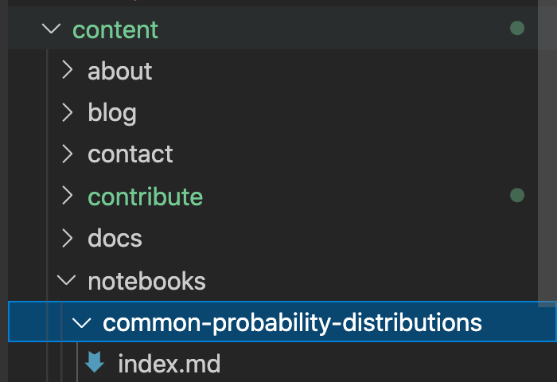
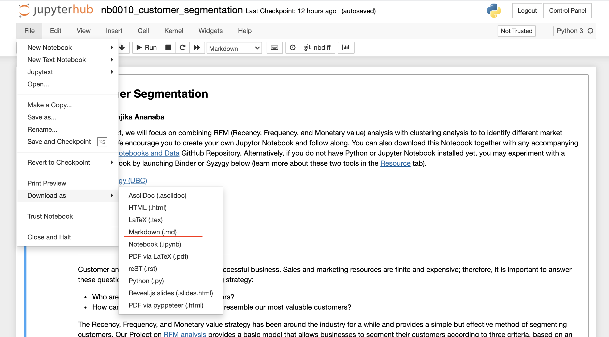
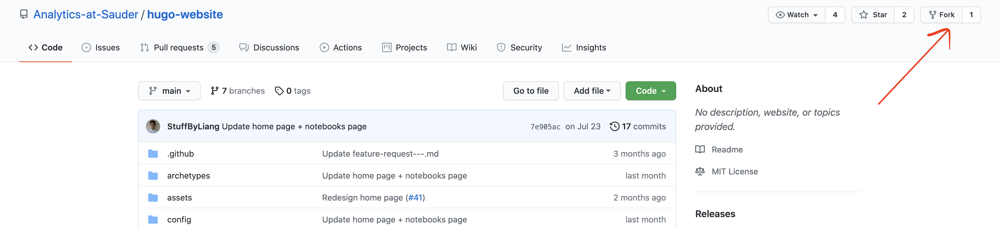
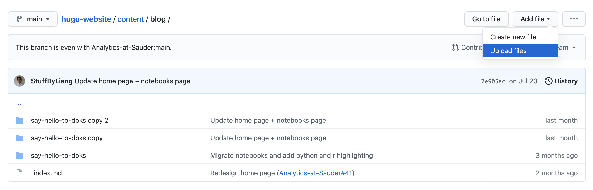
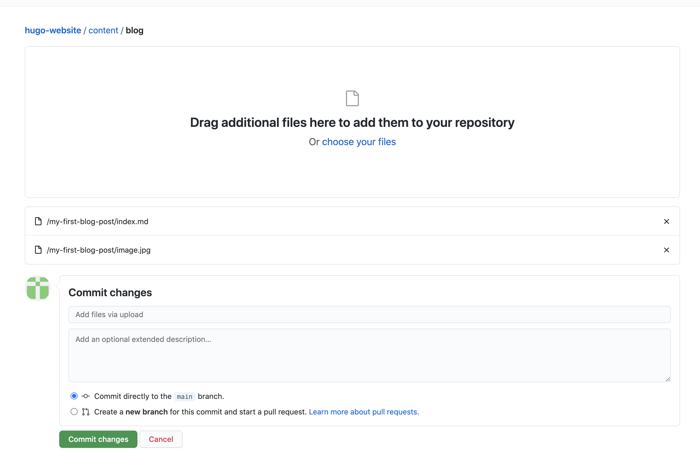
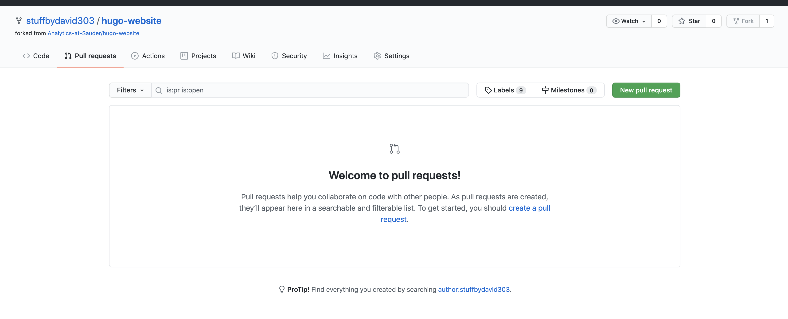
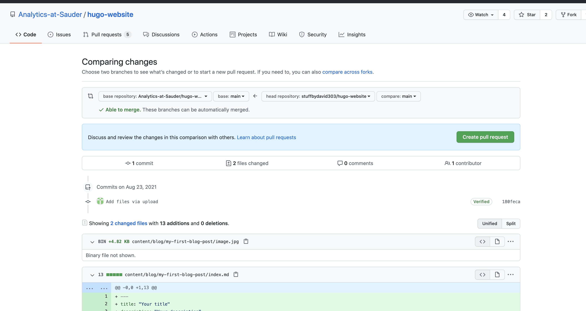

There are two ways to create a notebook.

1. By cloning the project and using the create command
2. By uploading your files to github directly

It is easier create a notebook using the first method.

## Cloning the project and using the create command

Make sure you have the project on your local computer and have the dependencies installed. You can [follow the guide here]().

### Step 1 - run the create command

Run this command to create a new folder in the directory `/content/notebooks/<your-notebook-name>`. Make sure to include a notebook name in kebab-case.



```bash
npm run create:notebook your-notebook-name
```

After running this command, you should see a folder created along with an index.md file inside of it.



### Step 2 - Download your Jypter Notebook

Go to your Jupyter Notebook and navigate through the menu File -> Download as -> Markdown (.md)



### Step 3 - Append the markdown contents

Append the markdown contents of the notebook you just downloaded into the newly created index.md in step 1. If there are any photos in the notebook, place them in the same directory.

In addition, this is the time to fill the following things in the newly created markdown file:

- `description` - A brief description for your notebook
- `lead` - A quick one sentence lead for your notebook
- `author` - Your name, or your team's names!
- `topics` - Topics that your notebook covers. his can be left blank.
- `skills` - Skills that your notebook uses. This can be left blank.

### Step 4 - Check the preview (optional)

Run the site using `npm start` and navigate to `localhost:1313/notebooks/your-notebook`. If it all looks good, it's time to upload! otherwise make content edits as necessary.

### Step 5 - Upload the changes

Create a new branch on github and push to it. Open a pull request so that other people can approve it before it's published on the site.

## By uploading your files to github directly

### Step 1 - Download your Jypter Notebook

Go to your Jupyter Notebook and navigate through the menu File -> Download as -> Markdown (.md)


### Step 2 - Create a folder on your local computer

Create a folder titled `<your-notebook-title>`. Make sure the title is in `lower-kebab-case`, meaning that all spaces are replaced with a dash, and all characters are in lowercase.

### Step 3 - Create a file

Create a file titled `index.md` within your newly created folder. Make sure to fill in the following:

- `title` - The title of your notebook
- `description` - A brief description for your notebook
- `lead` - A quick one sentence lead for your notebook
- `date` - The current date
- `lastmod` - The current date
- `images` - This can be left blank.
- `author` - Your name, or your team's names!
- `topics` - Topics that your notebook covers. his can be left blank.
- `skills` - Skills that your notebook uses. This can be left blank.

Append the markdown contents of the notebook you just downloaded into the newly created index.md. If there are any photos in the notebook, place them in the same directory.

```markdown
---
title: "Your Title"
description: "Description"
author: "Your name"
authorslink: ""
date: 2021-09-01T00:00:00
lastmod: 2021-09-01T00:00:00
draft: false
images: []
toc: true
menu:
  notebooks:
    parent: "notebooks"
weight: 50
topics:
  - example-topic-1
  - example-topic-2
skills:
  - example-skill
  - example-skill-2
---

<Append your notebook contents here>
```

### Step 4 - Fork the repository

Create a fork of the repository [https://github.com/Analytics-at-Sauder/hugo-website/](https://github.com/Analytics-at-Sauder/hugo-website/).



### Step 5 - Upload files to /content/notebook

Next, navigate to the folder `/content/notebooks/`. this should be located at the following link:

`https://github.com/<your-github-username>/hugo-website/tree/main/content/notebooks`



### Step 6 - Commit the changes

After uploading the images by drag/drop, make sure to commit your changes by clicking the big green `Commit Changes` button!



### Step 7 - Finally, submit a pull request!

Navigate to the forked repo, and submit a pull request by clicking on the `pull requests` tab, and then clicking on the green, `New pull request` button on the top right!



Follow the instructions, and an Analytics at Sauder team member will review and approve your changes accordingly.


