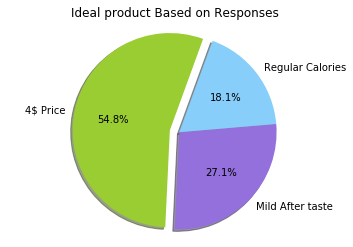
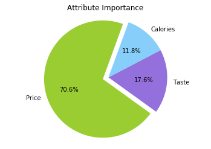
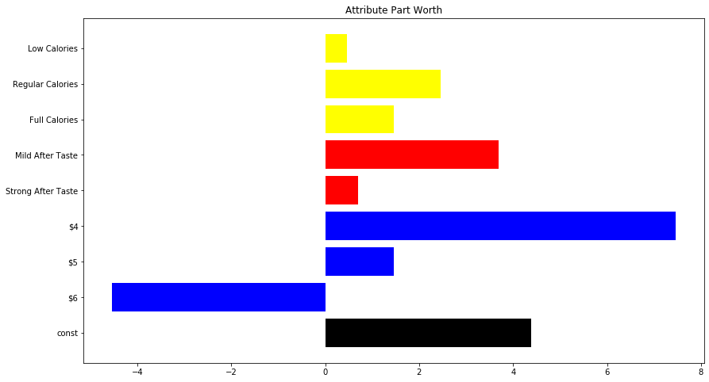

#### Author: Kemjika Ananaba

In this Project, we will learn about conjoint analysis and its application when introducing a new product into the market. Rank-based conjoint analysis is carried out in this Project using multiple linear regression. We encourage you to create your own Jupytor Notebook and follow along. You can also download this notebook together with any accompanying data in the [Notebooks and Data](https://github.com/Master-of-Business-Analytics/Notebooks_and_Data) GitHub Repository. Alternatively, if you do not have Python or Jupyter Notebook installed yet, you may experiment with a virtual Notebook by launching Binder or Syzygy below (learn more about these two tools in the [Resource](https://analytics-at-sauder.github.io/resource.html) tab).

<a href="https://ubc.syzygy.ca/jupyter/hub/user-redirect/git-pull?repo=https%3A%2F%2Fgithub.com%2FAnalytics-at-Sauder%2FNB0015_Conjoint_Analysis&urlpath=tree%2FNB0015_Conjoint_Analysis%2Fnb0015_conjoint_analysis.ipynb&branch=master" target="_blank" class="button">Launch Syzygy (UBC)</a>

<a href="https://pims.syzygy.ca/jupyter/hub/user-redirect/git-pull?repo=https%3A%2F%2Fgithub.com%2FAnalytics-at-Sauder%2FNB0015_Conjoint_Analysis&urlpath=tree%2FNB0015_Conjoint_Analysis%2Fnb0015_conjoint_analysis.ipynb&branch=master" target="_blank" class="button">Launch Syzygy (Google)</a>

<a href="https://mybinder.org/v2/gh/Analytics-at-Sauder/NB0015_Conjoint_Analysis/master?filepath=nb0015_conjoint_analysis.ipynb" target="_blank" class="button">Launch Binder</a>

## Business Problem

---

This Project focuses on the evaluation of market research for a new brand of beer. The simulated dataset captures three attributes that describe the new beer being introduced in the market: Price Point, After Taste, and Calorie Level. The Price Point and Calorie Level are recorded as levels. Rank-based conjoint analysis answers the following questions:

1. How important are certain features of a product to consumers?
2. What are the trade-offs consumers are willing to make with regards to the product features?

### Rank Based Conjoint Analysis

There are various ways to perform conjoint analysis. Here, we will focus on rank-based conjoint analysis. A Rank-Based Conjoint (RBC) model consists of exposing respondents to a set of product profiles, which all share the same attributes but at varying levels, and asks them to rank the product profiles from the best to the worst.

### Data

The dataset is an aggregated response from several survey responders. There are two columns: `Rank` and `Stimulus`. The Rank column shows how each of the 18 combinations of the three attributes are ranked, and the Stimulus column codes these product combinations based on the following categorizations:

<b> Attribute/Levels </b>

- "A" is Price Point with three levels:
  1. \\$6
  2. \\$5
  3. \\$4
- "B" is After Taste with two levels:
  1.  Strong
  2.  Mild
- "C" is Calorie Level with three levels:
  1.  Full
  2.  Regular
  3.  Low

```python
import numpy as np
import pandas as pd
import statsmodels.api as sm
import matplotlib.pyplot as plt
%matplotlib inline
```

```python
Data = pd.read_csv("nb0015_data/ConjointInput.csv", sep = ";")
Data.head(4)
```

<div>
<style scoped>
    .dataframe tbody tr th:only-of-type {
        vertical-align: middle;
    }

    .dataframe tbody tr th {
        vertical-align: top;
    }

    .dataframe thead th {
        text-align: right;
    }

</style>
<table border="1" class="dataframe">
  <thead>
    <tr style="text-align: right;">
      <th></th>
      <th>Stimulus</th>
      <th>Rank</th>
    </tr>
  </thead>
  <tbody>
    <tr>
      <th>0</th>
      <td>A1B1C1</td>
      <td>2</td>
    </tr>
    <tr>
      <th>1</th>
      <td>A1B1C2</td>
      <td>3</td>
    </tr>
    <tr>
      <th>2</th>
      <td>A1B1C3</td>
      <td>1</td>
    </tr>
    <tr>
      <th>3</th>
      <td>A1B2C1</td>
      <td>5</td>
    </tr>
  </tbody>
</table>
</div>

## Data Manipulation

The Stimulus column is a bit cryptic, so some data manipulation is needed here. In total, there are eight different product characteristics across the three attributes, and 18 different combinations.

```python
#create an 18 row by 9 column dataframe of zeros

ConjointDummyDF = pd.DataFrame(np.zeros((18,9)), columns=["Rank","A1", "A2", "A3",
                                                    "B1","B2",
                                                    "C1", "C2",
                                                    "C3"])
#converting data table to dataframe with dumnmy variables
# transfer rank column
ConjointDummyDF.Rank = Data.Rank
# For loop that inserts 1 if column name is present
for index, row in Data.iterrows():
    stimuli1, stimuli2, stimuli3 = Data["Stimulus"].loc[index][:2], \
    Data["Stimulus"].loc[index][2:4], Data["Stimulus"].loc[index][4:6]


    ConjointDummyDF.loc[index, [stimuli1,stimuli2,stimuli3]] = 1

ConjointDummyDF.head()
```

<div>
<style scoped>
    .dataframe tbody tr th:only-of-type {
        vertical-align: middle;
    }

    .dataframe tbody tr th {
        vertical-align: top;
    }

    .dataframe thead th {
        text-align: right;
    }

</style>
<table border="1" class="dataframe">
  <thead>
    <tr style="text-align: right;">
      <th></th>
      <th>Rank</th>
      <th>A1</th>
      <th>A2</th>
      <th>A3</th>
      <th>B1</th>
      <th>B2</th>
      <th>C1</th>
      <th>C2</th>
      <th>C3</th>
    </tr>
  </thead>
  <tbody>
    <tr>
      <th>0</th>
      <td>2</td>
      <td>1.0</td>
      <td>0.0</td>
      <td>0.0</td>
      <td>1.0</td>
      <td>0.0</td>
      <td>1.0</td>
      <td>0.0</td>
      <td>0.0</td>
    </tr>
    <tr>
      <th>1</th>
      <td>3</td>
      <td>1.0</td>
      <td>0.0</td>
      <td>0.0</td>
      <td>1.0</td>
      <td>0.0</td>
      <td>0.0</td>
      <td>1.0</td>
      <td>0.0</td>
    </tr>
    <tr>
      <th>2</th>
      <td>1</td>
      <td>1.0</td>
      <td>0.0</td>
      <td>0.0</td>
      <td>1.0</td>
      <td>0.0</td>
      <td>0.0</td>
      <td>0.0</td>
      <td>1.0</td>
    </tr>
    <tr>
      <th>3</th>
      <td>5</td>
      <td>1.0</td>
      <td>0.0</td>
      <td>0.0</td>
      <td>0.0</td>
      <td>1.0</td>
      <td>1.0</td>
      <td>0.0</td>
      <td>0.0</td>
    </tr>
    <tr>
      <th>4</th>
      <td>6</td>
      <td>1.0</td>
      <td>0.0</td>
      <td>0.0</td>
      <td>0.0</td>
      <td>1.0</td>
      <td>0.0</td>
      <td>1.0</td>
      <td>0.0</td>
    </tr>
  </tbody>
</table>
</div>

```python
fullNames = {"Rank":"Rank", \
           "A1": "$6","A2": "$5","A3": "$4", \
          "B1": "Strong After Taste", "B2":"Mild After Taste", \
           "C1":"Full Calories", "C2":"Regular Calories", "C3": "Low Calories",\
          }
#assign names to column names
ConjointDummyDF.rename(columns=fullNames, inplace=True)
#confirm that the names of the columns have changed
ConjointDummyDF.head()
```

<div>
<style scoped>
    .dataframe tbody tr th:only-of-type {
        vertical-align: middle;
    }

    .dataframe tbody tr th {
        vertical-align: top;
    }

    .dataframe thead th {
        text-align: right;
    }

</style>
<table border="1" class="dataframe">
  <thead>
    <tr style="text-align: right;">
      <th></th>
      <th>Rank</th>
      <th>$6</th>
      <th>$5</th>
      <th>$4</th>
      <th>Strong After Taste</th>
      <th>Mild After Taste</th>
      <th>Full Calories</th>
      <th>Regular Calories</th>
      <th>Low Calories</th>
    </tr>
  </thead>
  <tbody>
    <tr>
      <th>0</th>
      <td>2</td>
      <td>1.0</td>
      <td>0.0</td>
      <td>0.0</td>
      <td>1.0</td>
      <td>0.0</td>
      <td>1.0</td>
      <td>0.0</td>
      <td>0.0</td>
    </tr>
    <tr>
      <th>1</th>
      <td>3</td>
      <td>1.0</td>
      <td>0.0</td>
      <td>0.0</td>
      <td>1.0</td>
      <td>0.0</td>
      <td>0.0</td>
      <td>1.0</td>
      <td>0.0</td>
    </tr>
    <tr>
      <th>2</th>
      <td>1</td>
      <td>1.0</td>
      <td>0.0</td>
      <td>0.0</td>
      <td>1.0</td>
      <td>0.0</td>
      <td>0.0</td>
      <td>0.0</td>
      <td>1.0</td>
    </tr>
    <tr>
      <th>3</th>
      <td>5</td>
      <td>1.0</td>
      <td>0.0</td>
      <td>0.0</td>
      <td>0.0</td>
      <td>1.0</td>
      <td>1.0</td>
      <td>0.0</td>
      <td>0.0</td>
    </tr>
    <tr>
      <th>4</th>
      <td>6</td>
      <td>1.0</td>
      <td>0.0</td>
      <td>0.0</td>
      <td>0.0</td>
      <td>1.0</td>
      <td>0.0</td>
      <td>1.0</td>
      <td>0.0</td>
    </tr>
  </tbody>
</table>
</div>

## Linear Regression

Conjoint analysis works by observing how respondents' preferences change as one systematically varies the product features. It examines how they trade-off different aspects of the product, weighing options that have a mix of more desirable and less desirable qualities. The observations allow us to statistically deduce, through linear regression, the part-worth of all eight of the levels across the three product attributes.

Multiple linear regression attempts to model the relationship between multiple explanatory variables, such as the product features, and a response variable, the product rank, by fitting a linear equation to the observed data.

```python
#assign all columns apart from rank is assigned to variable X, which represents x axis
X = ConjointDummyDF[["$6", "$5","$4", "Strong After Taste","Mild After Taste",
"Full Calories","Regular Calories", "Low Calories"]]

#assign a constant to be defined as a benchmark
X = sm.add_constant(X)
#assign rank to Y variable
Y = ConjointDummyDF.Rank
#generate Linear regression model
linearRegression = sm.OLS(Y, X). fit()

#output of regression
df_res = pd.DataFrame({
    'feature': linearRegression.params.keys()
    , 'part_worth': linearRegression.params.values
    , 'pval': linearRegression.pvalues
})
df_res
```

<div>
<style scoped>
    .dataframe tbody tr th:only-of-type {
        vertical-align: middle;
    }

    .dataframe tbody tr th {
        vertical-align: top;
    }

    .dataframe thead th {
        text-align: right;
    }

</style>
<table border="1" class="dataframe">
  <thead>
    <tr style="text-align: right;">
      <th></th>
      <th>feature</th>
      <th>part_worth</th>
      <th>pval</th>
    </tr>
  </thead>
  <tbody>
    <tr>
      <th>const</th>
      <td>const</td>
      <td>4.384615</td>
      <td>1.931004e-185</td>
    </tr>
    <tr>
      <th>$6</th>
      <td>$6</td>
      <td>-4.538462</td>
      <td>9.384234e-180</td>
    </tr>
    <tr>
      <th>$5</th>
      <td>$5</td>
      <td>1.461538</td>
      <td>7.543620e-174</td>
    </tr>
    <tr>
      <th>$4</th>
      <td>$4</td>
      <td>7.461538</td>
      <td>2.406369e-182</td>
    </tr>
    <tr>
      <th>Strong After Taste</th>
      <td>Strong After Taste</td>
      <td>0.692308</td>
      <td>1.175104e-171</td>
    </tr>
    <tr>
      <th>Mild After Taste</th>
      <td>Mild After Taste</td>
      <td>3.692308</td>
      <td>2.218664e-180</td>
    </tr>
    <tr>
      <th>Full Calories</th>
      <td>Full Calories</td>
      <td>1.461538</td>
      <td>7.543620e-174</td>
    </tr>
    <tr>
      <th>Regular Calories</th>
      <td>Regular Calories</td>
      <td>2.461538</td>
      <td>1.448182e-176</td>
    </tr>
    <tr>
      <th>Low Calories</th>
      <td>Low Calories</td>
      <td>0.461538</td>
      <td>7.670223e-168</td>
    </tr>
  </tbody>
</table>
</div>

## Part Worth or Relative Utility

Central to the theory of conjoint analysis is the concept of product utility. Utility is a latent variable that reflects how desirable or valuable an object is in the mind of the respondent. The utility of a product is assessed from the value of its parts (part-worth). Conjoint analysis examines consumers’ responses to product ratings, rankings, or choices to estimate the part-worth of the various levels of each attribute of a product. Utility is not an absolute unit of measure; only relative values or differences in utilities matter.

We therefore focus on the coefficients in the multiple linear regression output because these represent the average part-worths or relative utility scores across all attributes. The higher the coefficient of a product attribute, the higher the relative utility. There are three different attributes in the eight different levels. The $4 Price Point (A3) ranks highest at a part-worth of 7.46; the second highest part-worth belongs to the Mild After Taste (B2), with a part-worth of 3.69; and the Regular Calories Level (C2) comes in third, with a part-worth at 2.46.

<b> What would be the optimal product bundle? </b>

```python
# Normalize values for each feature for the pie chart
raw = [7.46,3.69,2.46]
norm = [float(i)/sum(raw) for i in raw]
norm
```

    [0.5481263776634827, 0.27112417340191036, 0.1807494489346069]

```python
# Graph our winning product features

labels = '4$ Price', 'Mild After taste', 'Regular Calories'
#using values above
sizes = [54.8, 27.1, 18.1]
colors = ['yellowgreen', 'mediumpurple', 'lightskyblue']
explode = (0.1, 0, 0)
plt.pie(sizes,
        explode=explode,
        labels=labels,
        colors=colors,
        autopct='%1.1f%%',
        shadow=True,
        startangle=70
        )

plt.axis('equal')
plt.title('Ideal product Based on Responses')
plt.show()
```



## Relative Importance of the Product Attributes

The part-worth is used to derive the importance and the relative importance of a product's attributes. An attribute's importance is the difference between the highest and lowest utility level of the attribute. Relative importance of an attribute is essentially its share of importance.

If the distance between the utility levels of an attribute is large, then that attribute will have a larger bearing on the respondents choice of product than another attribute where the distance is not as large. The distance, therefore, is a reflection of the importance of the attribute in determining consumer preferences.

- Distance = Max(part-worth) - Min(part-worth)
- Weight of attribute/importance = attribute distance / sum(attribute distance)

```python
#Attribute importances

price= ['$4', '$5', '$6']
Taste = ['Strong After Taste', 'Mild After Taste']
Calories = ['Full Calories', 'Regular Calories', 'Low Calories']
#function to calculate distance
def distance_cal(lista):
    newlist =[]
    for item in lista:
        x= df_res.part_worth[(df_res['feature'] == item)][0]
        newlist.append(x)
    return max(newlist) - min(newlist)

```

```python
#create list of lists to be used in calculating the attribute importance and weight
attributes= [price,Taste,Calories]

#Create list attribute names
attributename = ['Price','Taste','Calories']
#Sum of attribute distance
sum_dist = distance_cal(price) + distance_cal(Taste) + distance_cal(Calories)
i=0
#For loop to print values of distance and weight for each variable
for item in attributes :
    print("\n Attribute : " , attributename[i])
    print ("\n Distance : " , distance_cal(item))
    print ("\n Importance %: " , distance_cal(item)/sum_dist)
    print("-----------------------")
    i=i+1

```

     Attribute :  Price

     Distance :  11.999999999999993

     Importance %:  0.7058823529411763
    -----------------------

     Attribute :  Taste

     Distance :  3.0000000000000013

     Importance %:  0.17647058823529427
    -----------------------

     Attribute :  Calories

     Distance :  1.9999999999999987

     Importance %:  0.11764705882352938
    -----------------------

```python
#Ploting the importance
sizes = [distance_cal(price)/sum_dist, distance_cal(Taste)/sum_dist, distance_cal(Calories)/sum_dist]
colors = ['yellowgreen', 'mediumpurple', 'lightskyblue']
explode = (0.1, 0, 0)
plt.pie(sizes,
        explode=explode,
        labels=attributename,
        colors=colors,
        autopct='%1.1f%%',
        startangle=70
        )

plt.axis('equal')
plt.title('Attribute Importance')
plt.show()
```



## Trade-off Analysis

Product developers are constantly faced with trade-offs. For instance, changing the taste of the beer from a Strong After Taste (B1) to a Mild After Taste (B2) would result in an increase in price as the beer requires more additional resources. Whether this would result in an increase in demand could be determined by examining the trade-offs that consumers are willing to make between a more preferred After Taste and a less desirable Price Point. The figure below illustrates the attributes part-worths that are considered in the trade-off analysis.

```python
f, ax = plt.subplots(figsize=(14, 8))
plt.title('Attribute Part Worth')
pwu = df_res['part_worth']

xbar = np.arange(len(pwu))
my_colors = ['black','blue','blue','blue','red','red','yellow','yellow','yellow']
plt.barh(xbar, pwu,color=my_colors)
plt.yticks(xbar, labels=df_res['feature'])
plt.show()

```



Knowledge of the relative importance of various attributes can assist in marketing and advertising decisions. Other factors being equal, we should devote greater attention and resources to improving a product in its attributes that are of greatest importance to target consumers.

## Final Conclusion

Conjoint analysis is a marketing research technique designed to help managers determine the preferences of customers and potential customers. In particular, it seeks to determine how consumers value the different attributes that make up a product and the trade-offs they are willing to make among the product's different attributes. As such, conjoint analysis is best suited for products with very tangible attributes that can be easily described or quantified.

## References

1. Conjoint Analysis. (n.d.). Retrieved from https://www.ashokcharan.com/Marketing-Analytics/~pd-conjoint-analysis.php
2. Herka. (2020). Traditional-Conjoint-Analysis-with-Python. Retrieved from https://github.com/Herka/Traditional-Conjoint-Analysis-with-Python/blob/master/Traditional Conjoint Analyse.ipynb
3. Pratama, A. (2018, December 04). How to Do Conjoint Analysis in python. Retrieved August 5, 2020, from https://ariepratama.github.io/How-to-do-conjoint-analysis-in-python/
4. Sreenivas, P., & Follow. (2019). Conjoint Analysis: A simple python implementation. Retrieved from https://www.linkedin.com/pulse/conjoint-analysis-simple-python-implementation-prajwal-sreenivas
5. Wilcox, Ronald T., A Practical Guide to Conjoint Analysis. Darden Case No. UVA-M-0675, Available at SSRN: https://ssrn.com/abstract=910102
