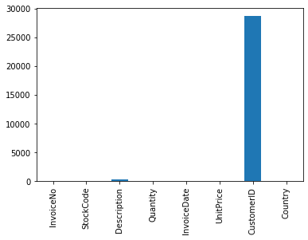
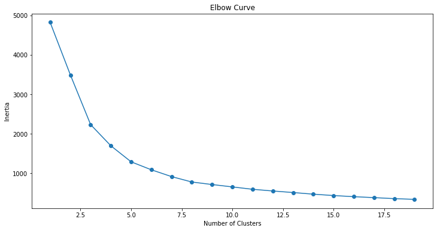
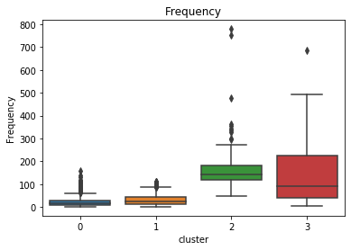

#### Author: Kemjika Ananaba

In this Project, we will focus on combining RFM (Recency, Frequency, and Monetary value) analysis with clustering analysis to to identify different market segments. We encourage you to create your own Jupytor Notebook and follow along. You can also download this Notebook together with any accompanying data in the [Notebooks and Data](https://github.com/Master-of-Business-Analytics/Notebooks_and_Data) GitHub Repository. Alternatively, if you do not have Python or Jupyter Notebook installed yet, you may experiment with a virtual Notebook by launching Binder or Syzygy below (learn more about these two tools in the [Resource](https://analytics-at-sauder.github.io/resource.html) tab).

<a href="https://ubc.syzygy.ca/jupyter/hub/user-redirect/git-pull?repo=https%3A%2F%2Fgithub.com%2FAnalytics-at-Sauder%2FNB0010_Customer_Segmentation&urlpath=tree%2FNB0010_Customer_Segmentation%2Fnb0010_customer_segmentation.ipynb&branch=master" target="_blank" class="button">Launch Syzygy (UBC)</a>

<a href="https://pims.syzygy.ca/jupyter/hub/user-redirect/git-pull?repo=https%3A%2F%2Fgithub.com%2FAnalytics-at-Sauder%2FNB0010_Customer_Segmentation&urlpath=tree%2FNB0010_Customer_Segmentation%2Fnb0010_customer_segmentation.ipynb&branch=master" target="_blank" class="button">Launch Syzygy (Google)</a>

<a href="https://mybinder.org/v2/gh/Analytics-at-Sauder/NB0010_Customer_Segmentation/master?filepath=nb0010_customer_segmentation.ipynb" target="_blank" class="button">Launch Binder</a>

## Business Problem

---

Customer analytics are crucial in running a successful business. Sales and marketing resources are finite and expensive; therefore, it is important to answer these questions when developing a marketing strategy:

- Who are our most/least valuable customers?
- How can we acquire new customers that resemble our most valuable customers?

The Recency, Frequency, and Monetary value strategy has been around the industry for a while and provides a simple but effective method of segmenting customers. Our Project on [RFM analysis](https://master-of-business-analytics.github.io/Website/RFM_Analysis.html) provides a basic model that allows businesses to segment their customers according to three criteria, based on an existing customer’s transaction history: the recency of a customer's last purchase, the frequency of a customer's purchases, and the total amount spent (which is referred to as "monetary").

An RFM model can also be used in conjunction with certain predictive models to gain even further insight into customer behaviour. In this Project, we analyze the k-means clustering algorithm to witness how this technique can enhance the results of an RFM analysis.

Here is a high-level flow of the analysis:

- We first calculate the R, F, and M parameters,
- Then we apply the k-means clustering algorithm on the three parameters to group similar customers.

K-means clustering is a popular approach for classification because of its simplicity in implementation and because it has been widely used in the practice of market segmentation. The number of clusters can be determined by using the elbow method.

## Dataset

There are eight variables in the dataset:

1. InvoiceNo: invoice number, a 6-digit integral number uniquely assigned to each transaction.
2. StockCode: product code, a 5-digit integral number uniquely assigned to each distinct product.
3. Description: product name.
4. Quantity: quantities of each product (item) per transaction.
5. InvoiceDate: invoice date and time, a numeric value of the date and time when each transaction was generated.
6. UnitPrice: unit price, a numeric value of the product price, per unit, in sterling.
7. CustomerID: customer number, a 5-digit integral number uniquely assigned to each customer.
8. Country

```python
import pandas as pd
import numpy as np
import seaborn as sns
from datetime import timedelta
import matplotlib.pyplot as plt
import warnings
from sklearn.cluster import KMeans
#ignore warnings
warnings.filterwarnings('ignore')

pd.set_option("display.max_columns",None);
pd.set_option("display.max_rows",None);

#load data
url = 'https://raw.githubusercontent.com/Master-of-Business-Analytics/Project_06_RFM_Analysis/master/data_1.csv'
df = pd.read_csv(url, error_bad_lines=False,encoding= 'unicode_escape')
```

```python
#summary of dataset
df.head(5)
```

<div>
<style scoped>
    .dataframe tbody tr th:only-of-type {
        vertical-align: middle;
    }

    .dataframe tbody tr th {
        vertical-align: top;
    }

    .dataframe thead th {
        text-align: right;
    }

</style>
<table border="1" class="dataframe">
  <thead>
    <tr style="text-align: right;">
      <th></th>
      <th>InvoiceNo</th>
      <th>StockCode</th>
      <th>Description</th>
      <th>Quantity</th>
      <th>InvoiceDate</th>
      <th>UnitPrice</th>
      <th>CustomerID</th>
      <th>Country</th>
    </tr>
  </thead>
  <tbody>
    <tr>
      <th>0</th>
      <td>540558</td>
      <td>21258</td>
      <td>?</td>
      <td>-29</td>
      <td>2011-01-10 10:04:00</td>
      <td>0.00</td>
      <td>NaN</td>
      <td>United Kingdom</td>
    </tr>
    <tr>
      <th>1</th>
      <td>540560</td>
      <td>21589</td>
      <td>NaN</td>
      <td>-14</td>
      <td>2011-01-10 10:08:00</td>
      <td>0.00</td>
      <td>NaN</td>
      <td>United Kingdom</td>
    </tr>
    <tr>
      <th>2</th>
      <td>540561</td>
      <td>22343</td>
      <td>PARTY PIZZA DISH RED RETROSPOT</td>
      <td>24</td>
      <td>2011-01-10 10:32:00</td>
      <td>0.21</td>
      <td>13004.0</td>
      <td>United Kingdom</td>
    </tr>
    <tr>
      <th>3</th>
      <td>540561</td>
      <td>22344</td>
      <td>PARTY PIZZA DISH PINK POLKADOT</td>
      <td>24</td>
      <td>2011-01-10 10:32:00</td>
      <td>0.21</td>
      <td>13004.0</td>
      <td>United Kingdom</td>
    </tr>
    <tr>
      <th>4</th>
      <td>540561</td>
      <td>47504H</td>
      <td>ENGLISH ROSE SPIRIT LEVEL</td>
      <td>24</td>
      <td>2011-01-10 10:32:00</td>
      <td>0.85</td>
      <td>13004.0</td>
      <td>United Kingdom</td>
    </tr>
  </tbody>
</table>
</div>

# Data Cleaning

The dataset seems to be relatively clean at first glance, but it is actually riddled with errors. There are several positive/negative offsetting entries throughout the dataset, in addition to other apparent errors, such as customers with negative transactions. More information on data cleaning can be found in our [Data Cleaning Project](https://master-of-business-analytics.github.io/Website/Data_Cleaning.html).

The first step in cleaning the dataset is to check if there are any missing values and where the missing values are located.

```python

#Visualize the number of null values in the dataframe for each column
df.isnull().sum().plot(kind='bar')
```

    <matplotlib.axes._subplots.AxesSubplot at 0x1a26fd03d0>



The bar chart above shows that the NaN values are located in the Description column and the CustomerID column. The purpose of this Project is to segment the current customers of a business; therefore, transactions without a valid CustomerID do not provide any value and are dropped from the data frame.

```python
#Eliminating rows with NA
df=df.dropna(subset=['CustomerID'])

#NA status across columns
df.isnull().sum()
```

    InvoiceNo      0
    StockCode      0
    Description    0
    Quantity       0
    InvoiceDate    0
    UnitPrice      0
    CustomerID     0
    Country        0
    dtype: int64

```python
df.describe()
```

<div>
<style scoped>
    .dataframe tbody tr th:only-of-type {
        vertical-align: middle;
    }

    .dataframe tbody tr th {
        vertical-align: top;
    }

    .dataframe thead th {
        text-align: right;
    }

</style>
<table border="1" class="dataframe">
  <thead>
    <tr style="text-align: right;">
      <th></th>
      <th>Quantity</th>
      <th>UnitPrice</th>
      <th>CustomerID</th>
    </tr>
  </thead>
  <tbody>
    <tr>
      <th>count</th>
      <td>60426.000000</td>
      <td>60426.000000</td>
      <td>60426.000000</td>
    </tr>
    <tr>
      <th>mean</th>
      <td>11.121868</td>
      <td>3.134313</td>
      <td>15500.429368</td>
    </tr>
    <tr>
      <th>std</th>
      <td>429.524058</td>
      <td>6.663764</td>
      <td>1597.854971</td>
    </tr>
    <tr>
      <th>min</th>
      <td>-74215.000000</td>
      <td>0.000000</td>
      <td>12346.000000</td>
    </tr>
    <tr>
      <th>25%</th>
      <td>2.000000</td>
      <td>1.250000</td>
      <td>14180.000000</td>
    </tr>
    <tr>
      <th>50%</th>
      <td>4.000000</td>
      <td>1.950000</td>
      <td>15408.000000</td>
    </tr>
    <tr>
      <th>75%</th>
      <td>12.000000</td>
      <td>3.750000</td>
      <td>16931.000000</td>
    </tr>
    <tr>
      <th>max</th>
      <td>74215.000000</td>
      <td>856.480000</td>
      <td>18283.000000</td>
    </tr>
  </tbody>
</table>
</div>

The summary table illustrates that very large negative values under Quantity. Further analysis shows that the minimum and maximum values have the same absolute values (74,215). This could simply be a product of a mistake in data entry. There are two ways data input errors are usually corrected:

- entering a value with the opposite sign to cancel out the previous mistake (so the minimum value will no longer be -74,215, but instead be +74,215, which is the maximum value), or
- entering the difference between the actual transaction and the previous entry.

The first instance is corrected by:

1. confirming that both transactions are for the same customer (if so, drop the duplicated row), and
2. repeating the previous step until the the minimum and maximum Quantity values do not have the same absolute values.

```python
#First of all we select relevant columns
df2 = df[['InvoiceDate',"CustomerID",'StockCode','UnitPrice','Quantity']]
#snapshoot of new dataframe
df2.head()
```

<div>
<style scoped>
    .dataframe tbody tr th:only-of-type {
        vertical-align: middle;
    }

    .dataframe tbody tr th {
        vertical-align: top;
    }

    .dataframe thead th {
        text-align: right;
    }

</style>
<table border="1" class="dataframe">
  <thead>
    <tr style="text-align: right;">
      <th></th>
      <th>InvoiceDate</th>
      <th>CustomerID</th>
      <th>StockCode</th>
      <th>UnitPrice</th>
      <th>Quantity</th>
    </tr>
  </thead>
  <tbody>
    <tr>
      <th>2</th>
      <td>2011-01-10 10:32:00</td>
      <td>13004.0</td>
      <td>22343</td>
      <td>0.21</td>
      <td>24</td>
    </tr>
    <tr>
      <th>3</th>
      <td>2011-01-10 10:32:00</td>
      <td>13004.0</td>
      <td>22344</td>
      <td>0.21</td>
      <td>24</td>
    </tr>
    <tr>
      <th>4</th>
      <td>2011-01-10 10:32:00</td>
      <td>13004.0</td>
      <td>47504H</td>
      <td>0.85</td>
      <td>24</td>
    </tr>
    <tr>
      <th>5</th>
      <td>2011-01-10 10:32:00</td>
      <td>13004.0</td>
      <td>84509G</td>
      <td>1.25</td>
      <td>12</td>
    </tr>
    <tr>
      <th>6</th>
      <td>2011-01-10 10:32:00</td>
      <td>13004.0</td>
      <td>22720</td>
      <td>4.95</td>
      <td>3</td>
    </tr>
  </tbody>
</table>
</div>

```python
#row data of maximum and minimum data
df2.loc[[df2['Quantity'].idxmax(),df['Quantity'].idxmin()]]
```

<div>
<style scoped>
    .dataframe tbody tr th:only-of-type {
        vertical-align: middle;
    }

    .dataframe tbody tr th {
        vertical-align: top;
    }

    .dataframe thead th {
        text-align: right;
    }

</style>
<table border="1" class="dataframe">
  <thead>
    <tr style="text-align: right;">
      <th></th>
      <th>InvoiceDate</th>
      <th>CustomerID</th>
      <th>StockCode</th>
      <th>UnitPrice</th>
      <th>Quantity</th>
    </tr>
  </thead>
  <tbody>
    <tr>
      <th>10537</th>
      <td>2011-01-18 10:01:00</td>
      <td>12346.0</td>
      <td>23166</td>
      <td>1.04</td>
      <td>74215</td>
    </tr>
    <tr>
      <th>10542</th>
      <td>2011-01-18 10:17:00</td>
      <td>12346.0</td>
      <td>23166</td>
      <td>1.04</td>
      <td>-74215</td>
    </tr>
  </tbody>
</table>
</div>

```python
#remove containing row minimum and maximum quantity as it is basically a duplicate
df2.drop(index=[df2['Quantity'].idxmax(), df2['Quantity'].idxmin()], inplace=True)

#chack minimum and maximum quantity
df2.describe()
```

<div>
<style scoped>
    .dataframe tbody tr th:only-of-type {
        vertical-align: middle;
    }

    .dataframe tbody tr th {
        vertical-align: top;
    }

    .dataframe thead th {
        text-align: right;
    }

</style>
<table border="1" class="dataframe">
  <thead>
    <tr style="text-align: right;">
      <th></th>
      <th>CustomerID</th>
      <th>UnitPrice</th>
      <th>Quantity</th>
    </tr>
  </thead>
  <tbody>
    <tr>
      <th>count</th>
      <td>60424.000000</td>
      <td>60424.000000</td>
      <td>60424.000000</td>
    </tr>
    <tr>
      <th>mean</th>
      <td>15500.533778</td>
      <td>3.134383</td>
      <td>11.122236</td>
    </tr>
    <tr>
      <th>std</th>
      <td>1597.778348</td>
      <td>6.663863</td>
      <td>46.762862</td>
    </tr>
    <tr>
      <th>min</th>
      <td>12747.000000</td>
      <td>0.000000</td>
      <td>-720.000000</td>
    </tr>
    <tr>
      <th>25%</th>
      <td>14180.000000</td>
      <td>1.250000</td>
      <td>2.000000</td>
    </tr>
    <tr>
      <th>50%</th>
      <td>15408.000000</td>
      <td>1.950000</td>
      <td>4.000000</td>
    </tr>
    <tr>
      <th>75%</th>
      <td>16931.000000</td>
      <td>3.750000</td>
      <td>12.000000</td>
    </tr>
    <tr>
      <th>max</th>
      <td>18283.000000</td>
      <td>856.480000</td>
      <td>3906.000000</td>
    </tr>
  </tbody>
</table>
</div>

<b> Note:</b> the minimum Quantity and maximum Quantity no longer have the same absolute values. However, if they continued to share the same absolute value, then the above step is repeated until they are no longer the same.

The next step is to convert the InvoiceDate column to a date format, and then calculate the total sales column, "Totalsum" (calculated as the Quantity multiplied by the UnitPrice for each transaction).

```python
# Convert InvoiceDate from object to datetime format
df2['InvoiceDate'] = pd.to_datetime(df2['InvoiceDate'])

#remove minutes and seconds from date
df2['InvoiceDate'] = df2.InvoiceDate.dt.date


#creating a total sales column
df2["Totalsum"] = df2['Quantity'] * df2['UnitPrice']

df2.head(5)
```

<div>
<style scoped>
    .dataframe tbody tr th:only-of-type {
        vertical-align: middle;
    }

    .dataframe tbody tr th {
        vertical-align: top;
    }

    .dataframe thead th {
        text-align: right;
    }

</style>
<table border="1" class="dataframe">
  <thead>
    <tr style="text-align: right;">
      <th></th>
      <th>InvoiceDate</th>
      <th>CustomerID</th>
      <th>StockCode</th>
      <th>UnitPrice</th>
      <th>Quantity</th>
      <th>Totalsum</th>
    </tr>
  </thead>
  <tbody>
    <tr>
      <th>2</th>
      <td>2011-01-10</td>
      <td>13004.0</td>
      <td>22343</td>
      <td>0.21</td>
      <td>24</td>
      <td>5.04</td>
    </tr>
    <tr>
      <th>3</th>
      <td>2011-01-10</td>
      <td>13004.0</td>
      <td>22344</td>
      <td>0.21</td>
      <td>24</td>
      <td>5.04</td>
    </tr>
    <tr>
      <th>4</th>
      <td>2011-01-10</td>
      <td>13004.0</td>
      <td>47504H</td>
      <td>0.85</td>
      <td>24</td>
      <td>20.40</td>
    </tr>
    <tr>
      <th>5</th>
      <td>2011-01-10</td>
      <td>13004.0</td>
      <td>84509G</td>
      <td>1.25</td>
      <td>12</td>
      <td>15.00</td>
    </tr>
    <tr>
      <th>6</th>
      <td>2011-01-10</td>
      <td>13004.0</td>
      <td>22720</td>
      <td>4.95</td>
      <td>3</td>
      <td>14.85</td>
    </tr>
  </tbody>
</table>
</div>

```python
# information about the data set
print('{:,} rows; {:,} columns'
      .format(df2.shape[0], df2.shape[1]))
print('{:,} transactions don\'t have a customer id'
      .format(df2[df2.CustomerID.isnull()].shape[0]))
print('Transactions timeframe from {} to {}'.format(df2['InvoiceDate'].min(),
                                    df2['InvoiceDate'].max()))
```

    60,424 rows; 6 columns
    0 transactions don't have a customer id
    Transactions timeframe from 2011-01-04 to 2011-03-30

# RFM Model

The RFM model describes the historical purchase behaviour of a company's current customers using three criteria:

- When did the customer make their last purchase?
- How often does the customer make a purchase?
- How much money does the customer spend?

The general assumption with the RFM model is that customers who purchase in shorter time intervals, in greater volumes, and at higher prices are more like to respond positively to future engagement and product offers. To identify who these responsive customers are, the customer records are grouped by the recency of the purchases, the frequency by the quantities, and the monetary value of the purchases.

```python
# create a table that aggregates the transactions by customer id to
# obtain recency score, frequency of purchase and monetary value


# set current date as most recent date plus one day
#df2['snapshot'] = df2['InvoiceDate'] + timedelta(days=1)

#group customers by their most recent purchase
snapshot_date = df2['InvoiceDate'].max() + timedelta(days=1)

#creat recency table by comparing most recent transaction to snapshot date by customer ID
rec_df = snapshot_date-df2.groupby("CustomerID").agg({"InvoiceDate":max})

#renaming column names
rec_df.rename(columns={"InvoiceDate": "Recency"}, inplace=True)#rename column
rec_df=rec_df["Recency"].apply(lambda x: x.days) #extracting number of days only

#creating frequency and monetary table by grouping number of purchases and total money spent by customer ID
fmTable = df2.groupby('CustomerID').agg({'CustomerID': lambda x: len(x),               # Frequency
                                        'Totalsum': lambda x: x.sum()})          # Monetary Value
#renaming column names
fmTable.rename(columns={
                         'CustomerID': 'Frequency',
                         'Totalsum': 'Monetary'}, inplace=True)

#combining the fm table and the recency table

rfm_df = pd.concat([rec_df,fmTable],axis=1)
rfm_df.head()

```

<div>
<style scoped>
    .dataframe tbody tr th:only-of-type {
        vertical-align: middle;
    }

    .dataframe tbody tr th {
        vertical-align: top;
    }

    .dataframe thead th {
        text-align: right;
    }

</style>
<table border="1" class="dataframe">
  <thead>
    <tr style="text-align: right;">
      <th></th>
      <th>Recency</th>
      <th>Frequency</th>
      <th>Monetary</th>
    </tr>
    <tr>
      <th>CustomerID</th>
      <th></th>
      <th></th>
      <th></th>
    </tr>
  </thead>
  <tbody>
    <tr>
      <th>12747.0</th>
      <td>30</td>
      <td>17.0</td>
      <td>613.82</td>
    </tr>
    <tr>
      <th>12748.0</th>
      <td>6</td>
      <td>337.0</td>
      <td>1820.35</td>
    </tr>
    <tr>
      <th>12820.0</th>
      <td>73</td>
      <td>11.0</td>
      <td>170.46</td>
    </tr>
    <tr>
      <th>12823.0</th>
      <td>1</td>
      <td>3.0</td>
      <td>994.50</td>
    </tr>
    <tr>
      <th>12826.0</th>
      <td>63</td>
      <td>40.0</td>
      <td>542.10</td>
    </tr>
  </tbody>
</table>
</div>

# Cluster Analysis

Clustering is the process of dividing the entire data into groups (also known as clusters) based on the patterns in the data. The k-means clustering technique is an algorithm that tries to minimize the distance of the points in a cluster to their centroid. There are two steps in cluster analysis:

1. finding the optimal number of clusters: the number of clusters, a value which decreases in inertia value and becomes constant, can be chosen as the right number of clusters for our data;

2. fit to the k-means model.

Looking at the RFM data table above, we observe a lot of variation in the magnitude of the data. Since k-means is a distance-based algorithm, this range in magnitude can be problematic; therefore, all the variables are standardized to the same magnitude using the scaler function.

```python


# --Calculate R and F groups--
rfm_df1= rfm_df.copy()

# Create labels for Recency and Frequency and MonetaryValue
r_labels = range(4, 0, -1) #[4,3,2,1]
f_labels = range(1, 5)   #[1,2,3,4]
#m_labels = range(1, 5)

# Assign these labels to 4 equal percentile groups
r_groups = pd.qcut(rfm_df1['Recency'], q=4, labels=r_labels)
# Assign these labels to1111 4 equal percentile groups
f_groups = pd.qcut(rfm_df1['Frequency'], q=4, labels=f_labels)

# Assign these labels to three equal percentile groups
#m_groups = pd.qcut(rfm_df1['Monetary'], q=4, labels=m_labels)


# Create new columns R_score, M_score and F_score
#rfm_df1 = rfm_df1.assign(R_score = r_groups.values, F_score = f_groups.values, M_score = m_groups.values)
#rfm_df1 = rfm_df1.assign(R_score = r_groups.values, F_score = f_groups.values)
#rfm_df1 = rfm_df1[['R_score','F_score','M_score']]
#rfm_df1 = rfm_df1[['R_score','F_score']]
#rfm_df1.head()
```

```python
# standardizing the data
from sklearn.preprocessing import StandardScaler
scaler = StandardScaler()
data_scaled = scaler.fit_transform(rfm_df)

```

```python
# fitting multiple k-means algorithms and storing the values in an empty list
SSE = []
for cluster in range(1,20):
    kmeans = KMeans(n_jobs = -1, n_clusters = cluster, init='k-means++')
    kmeans.fit(data_scaled)
    SSE.append(kmeans.inertia_)

# converting the results into a dataframe and plotting them
frame = pd.DataFrame({'Cluster':range(1,20), 'SSE':SSE})
plt.figure(figsize=(12,6))
plt.plot(frame['Cluster'], frame['SSE'], marker='o')
plt.xlabel('Number of Clusters')
plt.ylabel('Inertia')
plt.title('Elbow Curve')
```

    Text(0.5, 1.0, 'Elbow Curve')



```python
kmeans = KMeans(n_jobs = -1, n_clusters = 4, init='k-means++')
kmeans.fit(data_scaled)
pred = kmeans.predict(data_scaled)
rfm_df['cluster'] = pred
rfm_df.head()
```

<div>
<style scoped>
    .dataframe tbody tr th:only-of-type {
        vertical-align: middle;
    }

    .dataframe tbody tr th {
        vertical-align: top;
    }

    .dataframe thead th {
        text-align: right;
    }

</style>
<table border="1" class="dataframe">
  <thead>
    <tr style="text-align: right;">
      <th></th>
      <th>Recency</th>
      <th>Frequency</th>
      <th>Monetary</th>
      <th>cluster</th>
    </tr>
    <tr>
      <th>CustomerID</th>
      <th></th>
      <th></th>
      <th></th>
      <th></th>
    </tr>
  </thead>
  <tbody>
    <tr>
      <th>12747.0</th>
      <td>30</td>
      <td>17.0</td>
      <td>613.82</td>
      <td>1</td>
    </tr>
    <tr>
      <th>12748.0</th>
      <td>6</td>
      <td>337.0</td>
      <td>1820.35</td>
      <td>2</td>
    </tr>
    <tr>
      <th>12820.0</th>
      <td>73</td>
      <td>11.0</td>
      <td>170.46</td>
      <td>0</td>
    </tr>
    <tr>
      <th>12823.0</th>
      <td>1</td>
      <td>3.0</td>
      <td>994.50</td>
      <td>1</td>
    </tr>
    <tr>
      <th>12826.0</th>
      <td>63</td>
      <td>40.0</td>
      <td>542.10</td>
      <td>0</td>
    </tr>
  </tbody>
</table>
</div>

```python
#Cluster number
rfm_df.cluster.value_counts()
```

    1    934
    0    568
    2     96
    3      9
    Name: cluster, dtype: int64

<b>The cluster value where this decrease in inertia value becomes constant will be chosen as the appropriate cluster value for our data.</b> Looking at the above elbow curve, we can choose between four to six clusters; in other words, we can appropriately group our customer data into four to six customer segments. We will choose to set the number of clusters at five, and now we will proceed to fit the model.

As a note, we must also consider the computation cost when deciding the number of clusters to implement in our data, as computation costs increase with a higher number of clusters.

```python
#Recency plot
sns.boxplot(rfm_df.cluster,rfm_df.Recency)
plt.title('Recency')
plt.show()
```


```python
sns.boxplot(rfm_df.cluster,rfm_df.Frequency)
plt.title('Frequency')
plt.show()
```



```python
sns.boxplot(rfm_df.cluster,rfm_df.Monetary)
plt.title('Monetary')
plt.show()
```


# Final Conclusion

The box plots above show that the customers in Cluster 2 and Cluster 3 are the company's most recent and frequent customers. However, we can see that the customers in these two clusters account for less than 10% of the total number of customers.

This Project provides a brief example of how cluster analysis can enhance the results of RFM analysis. An RFM model can be used in conjunction with certain predictive models, such as k-means clustering, logistic regression, and recommendation to gain even further insight into customer behaviour, which can ultimately elevate a company's marketing strategy.

# References

1. Aditya,A. (2020, March 20). Predictive Segments using RFM Analysis: An In-Depth Guide. Retrieved July 03, 2020, from https://www.moengage.com/blog/rfm-analysis-using-predictive-segments/
2. Yexi Yuan. (2019, Aug 17). Recency, Frequency, Monetary Model with Python — and how Sephora uses it to optimize their Google and Facebook Ads. Retrieved July 03, 2020, from https://towardsdatascience.com/recency-frequency-monetary-model-with-python-and-how-sephora-uses-it-to-optimize-their-google-d6a0707c5f17
3. Campbell, A. (2020, July 05). Customer*segmentation. Lecture presented at EARL 2017 in London, London. https://earlconf.com/2017/downloads/london/presentations/EARL2017*-_London_-_Alexander_Campbell_-\_Customer_segmentation.pdf
4. Pulkit Sharma (2020, April 23). K Means Clustering: K Means Clustering Algorithm in Python. Retrieved July 14, 2020, from https://www.analyticsvidhya.com/blog/2019/08/comprehensive-guide-k-means-clustering/
5. Unknown. (2019, February 12). RFM Analysis. Retrieved July 14, 2020, from https://www.kaggle.com/yugagrawal95/rfm-analysis
